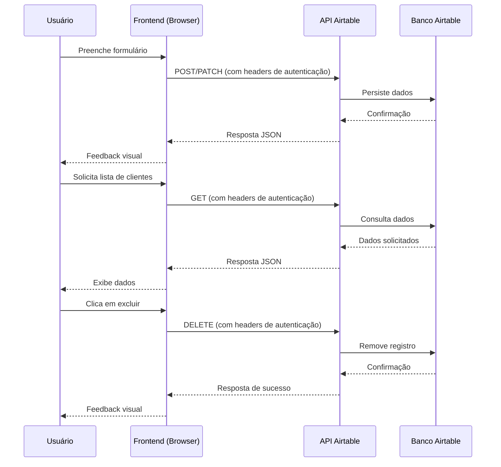

# CloudConnectt
# Sistema de Cadastro de Clientes com Airtable

Este é um sistema web completo para cadastro de clientes com persistência em nuvem via Airtable, implementando operações CRUD (Create, Read, Update, Delete).

## 📋 Pré-requisitos

- Conta no [Airtable](https://airtable.com/)
- Conta no [Replit](https://replit.com/) (opcional)
- Editor de código (VS Code, Sublime, etc.)

## 🔧 Configuração

### 1. Configuração do Airtable

1. Acesse [Airtable](https://airtable.com/) e crie uma nova base
2. Nomeie a base (ex: "DBX_CloudConnect")
3. Crie uma tabela chamada "Clientes" com os campos:
   - Nome (Texto)
   - Email (Email)
   - Telefone (Texto)

4. Obtenha suas credenciais:
   - **Base ID**: Encontrado na URL da sua base: `https://airtable.com/{BASE_ID}/{TABLE_NAME}`
   - **API Key**: Acesse [Account](https://airtable.com/account) > Generate API key

### 2. Configuração no Replit

1. Crie um novo projeto "HTML, CSS, JS" no Replit
2. Adicione os arquivos:
   - `index.html` (código HTML fornecido)
   - `style.css` (código CSS fornecido)
   - `script.js` (código JavaScript fornecido)

3. Configure as variáveis de ambiente (Secrets):
   - Clique no ícone de cadeado (Secrets) na barra lateral
   - Adicione a variável:
     - Key: `AIRTABLE_API_KEY`
     - Value: Seu API Key do Airtable

4. No arquivo `script.js`, atualize a constante:
   ```javascript
   const AIRTABLE_BASE_ID = 'sua_base_id_aqui'; // Substitua pelo seu Base ID
   ```

### 3. Variáveis Necessárias

| Variável | Onde Obter | Exemplo |
|----------|------------|---------|
| `AIRTABLE_API_KEY` | Airtable Account > API | `keyxxxxxxxxxxxx` |
| `AIRTABLE_BASE_ID` | URL da sua base Airtable | `appxxxxxxxxxxxx` |
| `AIRTABLE_TABLE_NAME` | Nome da sua tabela | `Clientes` |

## 🚀 Como Executar

### No Replit:
1. Clique no botão "Run" no Replit
2. O aplicativo será aberto em uma nova janela

### Localmente:
1. Salve os três arquivos em uma pasta
2. Instale uma extensão "Live Server" no VS Code
3. Abra o arquivo `index.html` com o Live Server

## 🔌 Diagrama de Sequência da Conexão com o Banco



## 🛡️ Considerações de Segurança

1. O token de API nunca é exposto no código frontend
2. No Replit, o token é armazenado de forma segura usando Secrets
3. Para produção, considere implementar um backend proxy para esconder completamente o token

## 🐛 Solução de Problemas

### Erro de CORS:
- O Airtable permite requisições de qualquer origem por padrão

### Erro de Autenticação:
- Verifique se o API Key está correto
- Verifique se o API Key tem permissões para a base

### Erro de Base ID:
- Verifique se o Base ID está correto
- Verifique se a tabela existe na base

### Campos não encontrados:
- Verifique se os nomes dos campos na tabela correspondem aos usados no código:
  - Nome
  - Email
  - Telefone

## 📝 Funcionalidades Implementadas

- ✅ Create - Adicionar novos clientes
- ✅ Read - Listar clientes cadastrados
- ✅ Update - Editar clientes existentes
- ✅ Delete - Excluir clientes
- ✅ Validação de formulários
- ✅ Interface responsiva
- ✅ Tratamento de erros
- ✅ Estados de carregamento
- ✅ Feedback visual para o usuário

## 🎨 Personalização

Para personalizar as cores do tema, edite as variáveis CSS no arquivo `style.css`:

```css
:root {
    --primary: #a8d5ba;       /* Cor primária */
    --primary-dark: #88bb9a;  /* Cor primária escura */
    --secondary: #c9e4de;     /* Cor secundária */
    --accent: #6b8f71;        /* Cor de destaque */
    /* ... outras cores */
}
```

## 📞 Suporte

Em caso de problemas:
1. Verifique o console do navegador (F12) para mensagens de erro
2. Confirme que as variáveis de ambiente estão configuradas corretamente
3. Verifique se a tabela no Airtable possui os campos corretos

---

**Nota**: Este sistema foi desenvolvido para fins educacionais e demonstração de integração com APIs. Para uso em produção, considere implementar validações adicionais e medidas de segurança.
